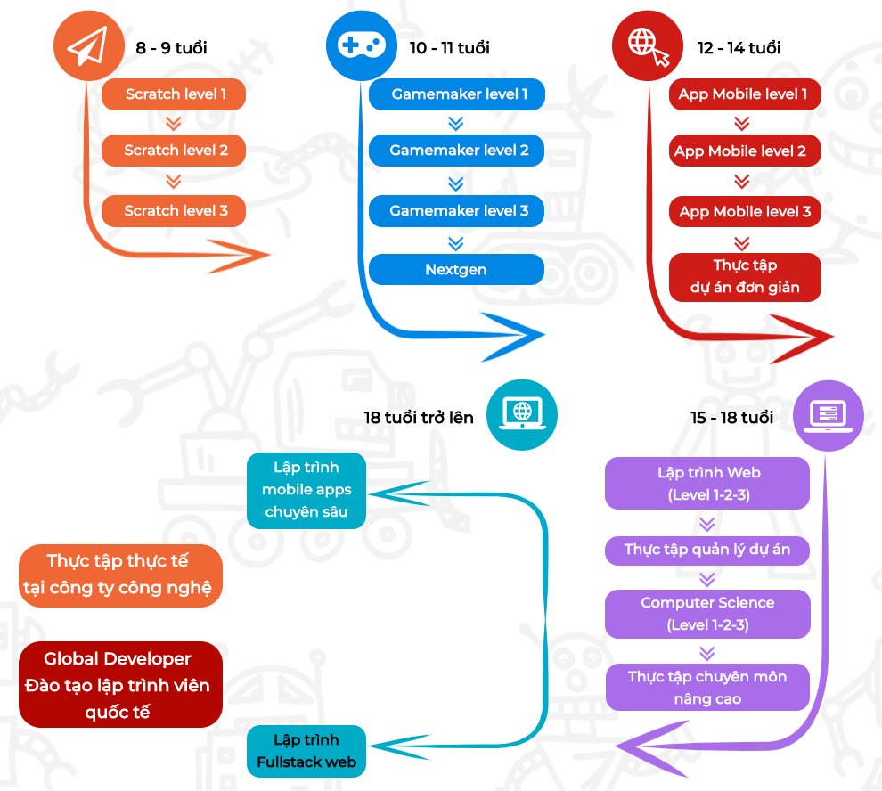

# Cùng con học lập trình với Scratch Jr.

Từ khi con trai 4 tuổi, tôi đã bắt đầu cho bạn ý chơi một số trò trên iPad có lồng ghép cái khái niệm lập trình, như LightBot, hay Code Adventures. Đến khi bạn ý 6 tuổi, tôi quyết định mỗi tuần đón sớm một hôm từ trường mẫu giáo để ngồi cùng bạn ý học lập trình trên Scratch Jr. Và tôi tin rằng **tất cả các bạn nhỏ Việt Nam** đều nên được tiếp xúc và học về Lập trình sớm nhất có thể \(tùy theo mức độ phát triển tư duy của từng bạn\).

Chính vì vậy, tôi lập nên trang web này để góp phần giới thiệu với các bố mẹ về phần mềm trên máy tính bảng tuyệt đỉnh để lập trình cùng con từ 5 đến 7 tuổi, Scratch Jr.

Nhưng trước khi nói về việc phần mềm đó hay như thế nào, có thể làm được những gì, cách sử dụng ra sao, thiết nghĩ cần phải giải thích rõ ràng ngay về lí do các bạn nên học lập trình cùng con. Quan điểm của tôi như sau:

1. Học lập trình là để rèn năng lực tư duy, khả năng sáng tạo, và phẩm chất. Học lập trình bây giờ KHÔNG phải để hướng nghiệp sau này.
2. Kể cả nếu bố mẹ chưa từng lập trình đi chăng nữa, chính bố mẹ vẫn là người tuyệt vời nhất để giúp con khám phá thế giới lập trình.

Nếu các bố mẹ đọc hai điều trên mà vỗ đùi đánh đét, chuẩn quá rồi, thì tuyệt, hãy chuyển luôn sang bài sau để khám phá ScratchJr ngay nhé. Còn nếu chưa tin lắm, xin mời đọc tiếp bài viết này.

### Trẻ học lập trình KHÔNG phải để làm lập trình viên

Những năm 2010 thôi, chưa mấy ai bàn đến chuyện dạy lập trình cho trẻ nhỏ từ cấp 1, cấp 2 cả. Nhưng năm 2013, đích thân tổng thống Obama đã có [bài phát biểu](https://www.youtube.com/watch?v=6XvmhE1J9PY) hướng tới tất cả học sinh sinh viên Mỹ thúc giục mọi người học khoa học máy tính vừa để đảm bảo cho tương lai nghề nghiệp chính mình, vừa để xây dựng tương lai nước Mỹ. Tổ chức phi lợi nhuận Code.org được hình thành, và tổng hợp những phát biểu từ hàng loạt doanh nhân thành đạt trong lĩnh vực công nghệ như Bill Gates hay Steve Jobs, hay ngay cả những người "không liên quan" như siêu sao bóng rổ Steve Curry, hay siêu mẫu  Karlie Kross, rằng "[tất cả mọi người đều nền học lập trình](https://code.org/promote)", nhấn mạnh vào sự thiếu hụt trầm trọng nhân sự trong lĩnh vực công nghệ. Những năm tiếp theo, hàng loạt các chương trình "phổ cập" lập trình cả trong và ngoài trường học xuất hiện, đưa ra những viễn cảnh hấp dẫn về nghề lập trình lương cao, tương lai tươi sáng. Một số nước phát triển khác như Nhật Bản, Hàn Quốc, Anh Quốc, đều đã đưa Lập trình vào thành [môn học bắt buộc từ cấp tiểu học](https://tuoitre.vn/tre-em-nhat-ban-se-phai-hoc-lap-trinh-tu-tieu-hoc-20190327104528742.htm).

Ở Việt Nam, đã có nhiều lời kêu gọi đưa Lập trình thành [môn học bắt buộc trong chương trình phổ thông](https://thanhnien.vn/giao-duc/bo-truong-nguyen-manh-hung-can-day-hoc-bat-buoc-mon-ngon-ngu-lap-trinh-o-pho-thong-1298957.html). Bộ trưởng Bộ Thông tin và truyền thông Nguyễn Mạnh Hùng nhấn mạnh rằng mỗi người đều cần phải biết 3 ngôn ngữ: Tiếng Việt, Tiếng Anh, và Tiếng Máy tính thì mới có thể cạnh tranh được trong thời đại mới 🧐 Nhiều trung tâm đã xuất hiện mở ra hàng loạt khóa học dạy lập trình, có những khóa cho trẻ em ngay từ 8 tuổi - tức là lớp 2, lớp 3 và khẳng khái cam kết việc làm lương ít nhất 10 triệu cho các cháu \(mà KHÔNG cần học đại học\) chỉ cần theo học hết được chương trình:

Nhưng tôi cho rằng, việc học lập trình cho trẻ em và cho người lớn là hoàn toàn khác nhau về mục tiêu, phải hiểu điều đó thật rõ thì việc học mới hiệu quả được.

**Với sinh viên hoặc người đã đi làm**, bạn hãy học lập trình khi và chỉ khi bạn có một mục tiêu cụ thể, sát sườn, cấp thiết. Hoặc là bạn muốn chuyển ngành, và sẵn sàng đầu tư xứng đáng để trở thành lập trình viên chuyên nghiệp - khi đó hãy đi học những khóa bài bản, dài hơi. Hoặc là công việc của bạn có những nhu cầu thực tế mà một chút kiến thức về lập trình có thể giúp bạn làm việc hiệu quả hơn - khi đó hãy tìm đến những khóa học chuyên sâu trong lĩnh vực hẹp liên quan đến công việc của bạn, ví dụ như VBA, AppScript. Chứ không nên "thử xem sao, biết đâu...". Việc trở thành lập trình viên chuyên nghiệp hoàn toàn có thể làm được, nhưng không dễ chút nào, nó đòi hỏi nhiều thời gian, công sức, sự bền chí, và đâu đó cũng cần có sự phù hợp về mặt tính cách và năng lực nữa, chứ không phải đơn giản cứ mua mấy khóa học trên Udemy hay tham gia 1-2 cái bootcamp là làm được ngay. \(Tất nhiên, học "cho vui" hoặc để rèn luyện tư duy thì quá được, nhưng lúc đó đặt kỳ vọng cho chính xác như vậy thôi - tự phát triển bản thân\)

**Nhưng với học sinh phổ thông, tiểu học, mẫu giáo**, thì sự chú trọng vào hướng-nghiệp là "sai bét" - nói theo giọng thằng con tôi. Thứ nhất, còn tới 5-10 năm nữa chúng mới đến tuổi đi làm, lúc đó thì tất cả những gì đang học hiện tại đã lỗi thời hết rồi. 10 năm nữa, chắc gì đã còn cần người làm web hay làm mobile apps, lúc đó có khi AI \(trí tuệ nhân tạo\) tự làm hết được những thứ đó rồi. Thậm chí, bản thân những khái niệm đó chưa chắc đã còn _tồn tại_. Thứ hai, là một _nghề_, lập trình chuyên nghiệp cũng đòi hỏi những năng lực, tính cách đặc thù mà không phải ai cũng có. Không phải ai cũng có thể làm ca sĩ, doanh nhân, vận động viên, và đương nhiên không phải ai cũng có thể làm kĩ sư. Mục đích phổ cập lập trình cho trẻ, nếu có, phải là một điều gì đó khác.

Và đấy là điều tôi muốn nhấn mạnh với bố mẹ: Hãy giới thiệu con đến với thế giới của lập trình để rèn tư duy, rèn sáng tạo, và rèn phẩm chất, chứ đừng chú trọng quá vào bản thân _kĩ năng lập trình_ của con.

Tất nhiên, vì thời gian và sức lực có hạn, sẽ tốt hơn khi chúng ta ưu tiên những bộ môn có khả năng xây dựng được nhiều nền tảng thiết yếu nhất, phải không. Và đấy chính là lí do tôi chọn Lập trình - ngoại trừ mảng Vận động ra, thì học Lập trình giúp trẻ rèn luyện được hàng loạt những kĩ năng mềm và phẩm chất cực kỳ quan trọng.

